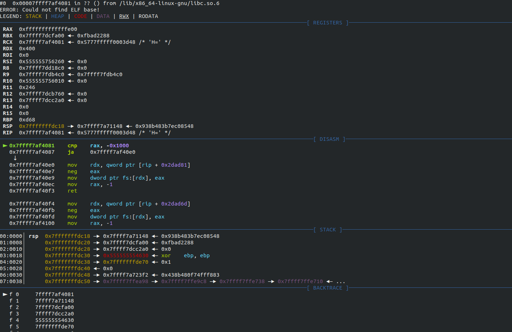
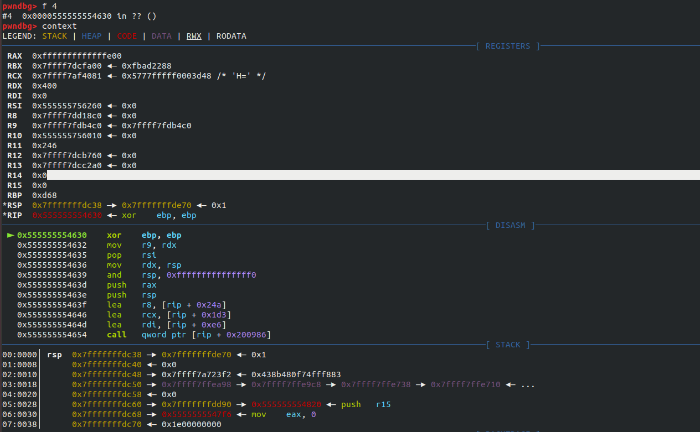
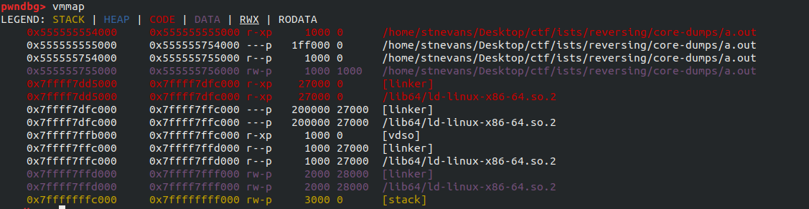
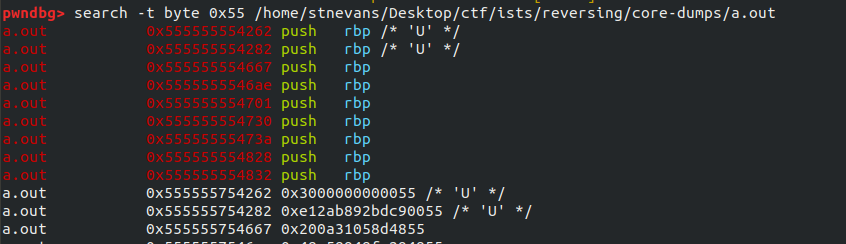
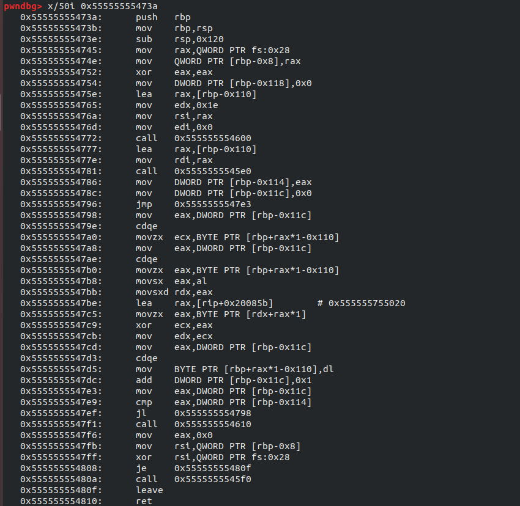
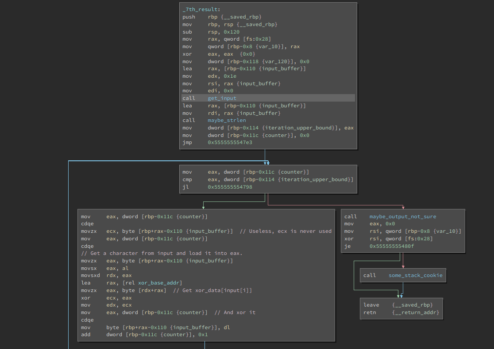
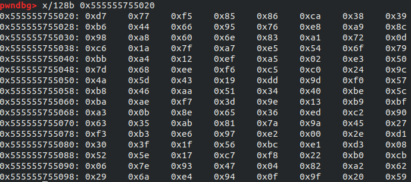
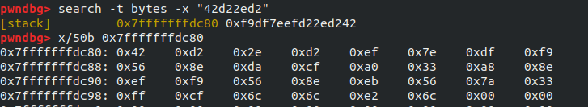

For this reversing challenge, we are given a core dump.

Strings has nothing, so it seems like we should take a look at it in gdb. (using pwndbg)
`gdb -ex "core-file core.19717"`

As you can see, it stopped at 0x7ffff7af4081. At the bottom, it shows a backtrace of the program. Nothing immediately jumps out, so let's do some recon.

If we run `f 4`, followed by `context`, we switch gdb to looking at the frame containing 0x555555554630, which was the address sticking out in the backtrace.

The disassembled code in this region looks somewhat odd, and not all that relevant to us. It's clearing ebp, then doing some other operations for no apparent reason. Looking at this address didn't give us much, so let's try to get a higher level view of our binary.

With pwndbg, you can run `vmmap` to list what regions of memory are mapped.

Looking at the first thing in that output, you can see the executable is at at address 0x555555554000. That first mapping has the executable and readable bit, so it's the one containing the text section.

Now that we know roughly what's going on, it makes sense to find all the functions in the binary. There's no easy way to do this, so we're going to have to make up our own way. 

Basically every function in assembly starts with `push rbp`, as that allows for a clean stack frame to be created. Let's find all the functions by searching for "55", or the opcode of `push rbp` in our binary.
`search -t byte 0x55 /home/stnevans/Desktop/ctf/ists/reversing/core-dumps/a.out`


As pwndbg highlights executable sections in red, we only have to look at the candidates in the red sections.

For each of those red functions addresses, we're going to go through and run `x/20i 0xaddress`. We want to filter out any false positives, so anything that doesn't look like a real function can be ignored.

The first two results (0x555555554262,0x555555554282) both look like false positives. There's no `ret` in sight, and there are weird looking sequences of assembly around that area.

The third 3-5 results (0x555555554667,0x5555555546ae,0x555555554701) seems to be a real function, but it is very short and doesn't do anything clearly interesting.

The 6th one (0x555555554730) immediately jumps somewhere else.

The 7th result, however, is interesting. It's a real function, and it seems to be doing a decent amount of things. Let's take a closer look.


For a clearer picture of the assembly, here's a commented binary ninja screenshot:

The main body of the function is a for loop, which can be found in the bottom left of the screenshot. In the for loop, it loads a byte from the input buffer, does an xor with some contents of xor_base, and saves it back to input_buffer. The function approximately looks like this in c:

```
char[] input_buffer = get_input();
int  len = maybe_strlen(input_buffer);
for(int i = 0; i < len; i++){
    input_buffer[i] = xor_base_addr[input_buffer[i]] ^ input_buffer[i];
}
```

It looks like there's some input given that we probably need to reconstruct.
There are various ways to proceed to accomplish this. The way I find simplest is running a sort of known plaintext attack. We can find the contents of `xor_base_addr`, and therefore we can encode anything we want using it. Let's just encode `ISTS{` and search for that in memory to find where our encoded flag is. We can then use `xor_base_addr` to find it.

First, let's dump the contents of xor_base_addr (128 bytes, because that's readable ascii).


Now, let's write a c program to tell us the encoding of "ISTS". 
```
#include <stdio.h>
unsigned char xor_base[] = {0xd7,0x77,0xf5,0x85,0x86,0xca,0x38,0x39,0xb6,0x44,0x66,0x95,0x76,0xe8,0xa9,0x8c,0x98,0xa8,0x60,0x6e,0x83,0xa1,0x72,0xd,0xc6,0x1a,0x7f,0xa7,0xe5,0x54,0x6f,0x79,0xbb,0xa4,0x12,0xef,0xa5,0x2,0xe3,0x50,0x7d,0x68,0xee,0xf6,0xc5,0xc0,0x24,0x9c,0x4a,0x5d,0x43,0x19,0xdd,0x9d,0xf0,0x57,0xb8,0x46,0xaa,0x51,0x34,0x40,0xbe,0x5c,0xba,0xae,0xf7,0x3d,0x9e,0x13,0xb9,0xbf,0xa3,0xb,0x8e,0x65,0x36,0xed,0xc2,0x90,0x63,0x35,0xab,0x81,0x7a,0x9a,0x45,0x27,0xf3,0xb3,0xe6,0x97,0xe2,0x0,0x2e,0xd1,0x30,0x3f,0x1f,0x56,0xbc,0xe1,0xd3,0x8,0x52,0x5e,0x17,0xc7,0xf8,0x22,0xb0,0xcb,0x6,0x7e,0x93,0x47,0x4,0x82,0xa2,0x62,0x29,0x6a,0xe4,0x94,0xf,0x9f,0x20,0x59};
unsigned char encode(unsigned char pt){
	return pt ^ xor_base[pt];
}
int main(){
    printf("%x%x%x%x\n",
    encode('I'), encode('S'), encode('T'), encode('S'));
}
```
```
gcc encode.c -o encode
./encode
42d22ed2
```
Now, using this, let's find the rest of the encoded string in memory.
`search -t bytes -x "42d22ed2"` and `x/32b 0x7fffffffdc80`.


We know have our encoded flag, and the algorithm used to encode it. We can now create a mapping of encoded byte - > unencoded byte. With this mapping, we can print out every reasonable unencoded byte for each decoded byte.
```
#include <stdio.h>
#include <stdbool.h>
char xor_base[] = {0xd7,0x77,0xf5,0x85,0x86,0xca,0x38,0x39,0xb6,0x44,0x66,0x95,0x76,0xe8,0xa9,0x8c,0x98,0xa8,0x60,0x6e,0x83,0xa1,0x72,0xd,0xc6,0x1a,0x7f,0xa7,0xe5,0x54,0x6f,0x79,0xbb,0xa4,0x12,0xef,0xa5,0x2,0xe3,0x50,0x7d,0x68,0xee,0xf6,0xc5,0xc0,0x24,0x9c,0x4a,0x5d,0x43,0x19,0xdd,0x9d,0xf0,0x57,0xb8,0x46,0xaa,0x51,0x34,0x40,0xbe,0x5c,0xba,0xae,0xf7,0x3d,0x9e,0x13,0xb9,0xbf,0xa3,0xb,0x8e,0x65,0x36,0xed,0xc2,0x90,0x63,0x35,0xab,0x81,0x7a,0x9a,0x45,0x27,0xf3,0xb3,0xe6,0x97,0xe2,0x0,0x2e,0xd1,0x30,0x3f,0x1f,0x56,0xbc,0xe1,0xd3,0x8,0x52,0x5e,0x17,0xc7,0xf8,0x22,0xb0,0xcb,0x6,0x7e,0x93,0x47,0x4,0x82,0xa2,0x62,0x29,0x6a,0xe4,0x94,0xf,0x9f,0x20,0x59};
unsigned char ** dec_tbl; 
unsigned int * dec_counts;
//dec_tbl [c] represents all characters that when provided as input to the original program in the core dump, could result in encoded character c.
//dec_counts[c] is the amount of characters that could result in encoded character c.

//Our encoded flag
unsigned char enc[] = {0x42,0xd2,0x2e,0xd2,0xef,0x7e,0xdf,0xf9,0x56,0x8e,0xda,0xcf,0xa0,0x33,0xa8,0x8e,0xef,0xf9,0x56,0x8e,0xeb,0x56,0x7a,0x33,0xff,0xcf,0x6c,0x6c,0xe2,0x6c};

bool check_char(unsigned char c){
	if(c > 128){
		return false;
	}
	if(c >= '0' && c <= '9'){
		return true;
	}
	if(c == '_' || c == '{' || c == '}'){
		return true;
	}
	if(c >='A' && c <= 'Z'){
		return true;
	}
	return false;
}
void create_map(){
	for (unsigned char i = 0x10; i < 128; i++){
		unsigned char val =  (unsigned char)( i ^ xor_base[i]);
		dec_tbl[val][dec_counts[val]++] = i;
	}
}

void init_decode(){
	dec_tbl = malloc(256 * sizeof(char *));
	dec_counts = malloc(256 * sizeof(int));

	for(int i = 0; i < 256; i++){
		dec_tbl[i] = malloc(0x10);
		dec_counts[i] = 0;
	}
}

void decode(){
	for(int i = 0; i < sizeof(enc); i++){
		for(int j = 0; j < dec_tbl[enc[i]][dec_counts[0]]; j++){
			unsigned char decoded = dec_tbl[enc[i]][j];
			if(check_char(decoded)){	
				printf("%c",  decoded); 
			}
		}
		puts("");
	}
}

int main(){
	init_decode();
	create_map();
	decode();
}
```
```
gcc get_flag.c -o get_flag -g
./get_flag                   
I
S
KT
S
A{
C98
O
R
E
_
D
U
M
P
5
_
A{
R
E
_
H
E
0L
P
FFFFFFFFFFFFFFFFFFFFFFFFFFFFFFFFFFFFFFF
U
1
1
}
1
```
Ignoring any bugs (why are there so many Fs?), we can look at this to get the flag: ISTS{CORE_DUMP5_ARE_HELPFU11}

Quick note: you can also avoid a lot of the gdb stuff if you use a good dissasembler such as binary ninja that supports loading core files. That way, you don't have to manually determine where functions are.